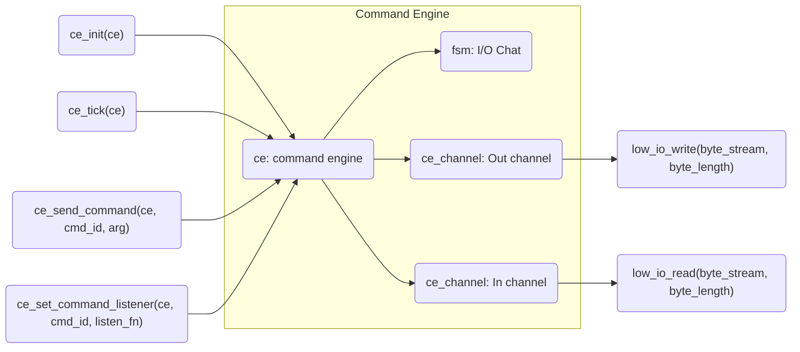

```mermaid
graph LR
	ce(ce: command engine)
	fsm.chat(fsm: I/O Chat)
	ce_channel.out(ce_channel: Out channel)
	ce_channel.in(ce_channel: In channel)
	
    ce_init("ce_init(ce)") --> ce
    ce_tick("ce_tick(ce)") --> ce
    ce_send_command("ce_send_command(ce, cmd_id, arg)") --> ce
    ce_set_command_listener("ce_set_command_listener(ce, cmd_id, listen_fn)") --> ce
    subgraph "Command Engine"
    	ce
		ce --> fsm.chat
		ce --> ce_channel.out
		ce --> ce_channel.in
    end
	ce_channel.out --> low_io_write("low_io_write(byte_stream, byte_length)")
	ce_channel.in --> low_io_read("low_io_read(byte_stream, byte_length)")
```

