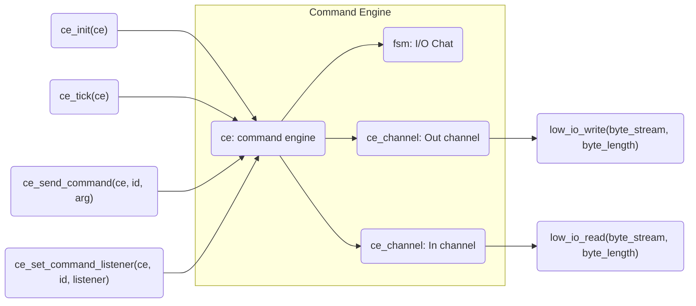
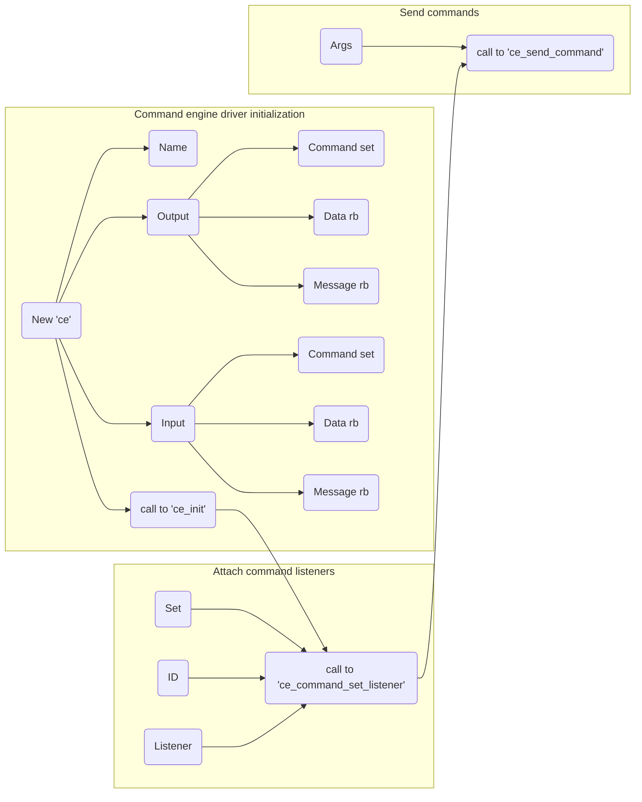

```mermaid
graph LR
	ce(ce: command engine)
	fsm.chat(fsm: I/O Chat)
	ce_channel.out(ce_channel: Out channel)
	ce_channel.in(ce_channel: In channel)
	
    ce_init("ce_init(ce)") --> ce
    ce_tick("ce_tick(ce)") --> ce
    ce_send_command("ce_send_command(ce, id, arg)") --> ce
    ce_set_command_listener("ce_set_command_listener(ce, id, listener)") --> ce
    subgraph "Command Engine"
    	ce
		ce --> fsm.chat
		ce --> ce_channel.out
		ce --> ce_channel.in
    end
	ce_channel.out --> low_io_write("low_io_write(byte_stream, byte_length)")
	ce_channel.in --> low_io_read("low_io_read(byte_stream, byte_length)")
```

```mermaid
graph LR
    subgraph "Command engine driver initialization"
    	ce_new(New 'ce')
    	ce_new --> ce_new_name(Name)
    	ce_new --> ce_new_out_channel(Output)
    	ce_new_out_channel --> ce_new_out_channel_cmd_set(Command set)
    	ce_new_out_channel --> ce_new_out_channel_cmd_data(Data rb)
    	ce_new_out_channel --> ce_new_out_channel_cmd_buffer(Message rb)
    	ce_new --> ce_new_in_channel(Input)
    	ce_new_in_channel --> ce_new_in_channel_cmd_set(Command set)
    	ce_new_in_channel --> ce_new_in_channel_cmd_data(Data rb)
    	ce_new_in_channel --> ce_new_in_channel_cmd_buffer(Message rb)
    	ce_new --> ce_init_call(call to 'ce_init')
    end
    subgraph "Attach command listeners"
        ce_listener_previous_set(Set)
        ce_listener_previous_cmd(ID)
        ce_listener_previous_listener(Listener)
        ce_listener_previous_set --> ce_set_listener_call(call to 'ce_command_set_listener')
        ce_listener_previous_cmd --> ce_set_listener_call
    	ce_listener_previous_listener --> ce_set_listener_call
    end
    subgraph "Send commands"
        ce_send_previous_args(Args)
    	ce_send_previous_args --> ce_send(call to 'ce_send_command')
    end
    ce_init_call --> ce_set_listener_call
    ce_set_listener_call --> ce_send
```

